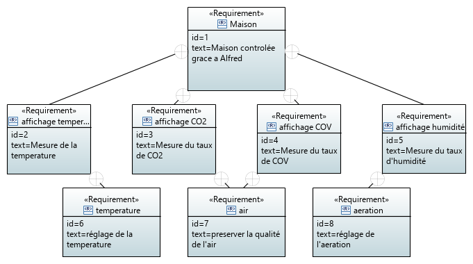
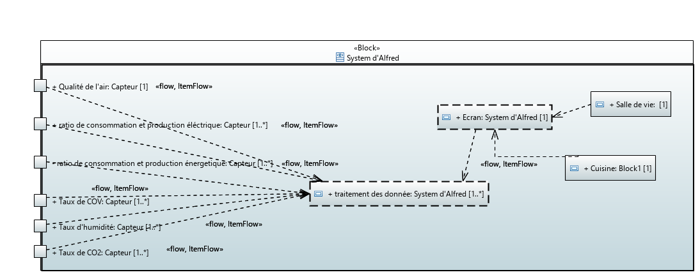

# Rapport

### Diagramme Requirement

### Diagramme User Case

Pour ce diagramme on a place Alfred en tant qu'acteur principale, et on a pris comme action
"Mesurer le taux de CO2" et "Mesurer le taux de COV", ces actions permettent de préserver la
qualité de l'air. 
on a aussi pris comme action "Mesurer la température" et "Mesurer le taux d'humidité"; ces actions
permettant respectivement de "regler la temperature" et "regler l'aération".    

### Diagramme de blocs (BDD)

Pour ce diagramme on est parti d'un bloc representant le système souhaité ("Systeme d'Alfred") qui as comme attribut des indicateurs, ce block est relié
à un block "Capteur". On a representé les elements dont on a besoin pour utiliser les indicateurs en tant que
blocs (Electricité, Eau, Air, Température, etc...), qui eux mêmes sont reliés au capteur. Ce systeme
calcule les données dont Alfred a besoin. Puis Alfred recupere les statistiques/indicateurs qui s'affichent sur un ecran.

### Diagramme de bloc internes (IBD)

Dans ce diagramme on fait l'etude du block "Systéme d'Alfred" qui se trouve dans le BDD. On a voulu considerer
les indicateurs qui étaient déjà passé par les capteurs afin d'obtenir les resultats voulus.
Puis on traite ces données pour les afficher finalement sur un ecran, par example, dans la cuisine ou la salle de vie.